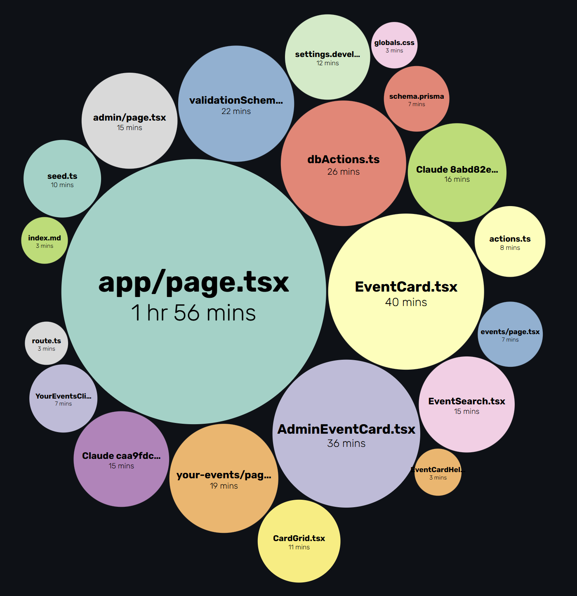

# Tracking Effort

I made my effort estimates using [WakaTime](https://wakatime.com/), an automated time-tracking tool that helps software engineers like us keep track of how much time we spend coding in an IDE like Visual Studio Code. Along with this tool, I research which parts of the code need to be changed, why they need to be changed, and whether any AI tools will be involved. Then I shortly reflect on my capabilities and skills to finally create an accurate estimation of how long this specific issue is going to take. I would say that I am confident in my abilities, but certain issues might be harder than others, so I also accounted for minutes for potential AI usage in terms of creating prompts, verification, and implementation towards the code. This sort of checklist, although not totally accurate, keeps things organized to ensure I, as well as my other group mates, were making satisfactory progress towards our upcoming milestones.

# Estimating in Advance

Estimating in advance did provide benefits because it helped me to stay on track with these issues, where they were like mini due dates in a way that motivated me to get it done before the time limit. For instance, there was one specific task that I was assigned to update the landing page on the Bowfolios template. Having this landing page serves as some sort of basis for the project, as it as documentation and instructions on what our web application is about. I really wanted to challenge myself by implementing the landing page without using AI, so based on my skills and capabilities, I estimated that I could finish the landing page in 200 minutes or in about 3 hours and 33 minutes. I know, it is really long, but without using AI, I had to factor in what I need to change based on the drawn mock-up I was given, then research any cool Bootstrap 5 widgets to make the landing page more appealing to the users. After I finish, I looked at the time from WakaTime and noticed that I finished it under 3 hours, for which I implemented the landing page at approximately 140 minutes or 2 hours and 33 minutes. Setting these estimated expectations motivated me to do the best I can during this time, where, based on this information, I could reflect and maybe shorten my estimated time on future issues.

# Tracking Actual Effort

Tracking actual effort was a way for me to not only track my group mate's progress but also mine as well. It helps me reflect on my abilities as an aspiring software engineering student to see what I need to improve and what I need to know in advance before I tackle these issues. Tracking these actual estimation efforts also factors into that checklist that I mention in the **Tracking Effort** section where I can slightly adjust my time on future issues as needed.

# Reflection

In terms of next time, I would also want to note and accurately estimate AI usage as well. Even though I record it in my estimation times, I felt like I was not recording it well enough since during times of AI usage, I mostly try to eyeball the estimation in terms of verifying it, implementing it, and even prompting it. Being able to accurately log AI usage into these issues can better help reflect on what questions I need to ask the AI, and how long I could expect it to generate a solution based on that description.

# AI Usage

For the final project, I mostly used Claude Code since it can easily see the code and make suggestions on the fly without having to copy and paste code or describing what I want in very clear detail. Some of the prompts I asked Claude were mostly descriptive questions on how I want it implemented. I mostly use it to connect the code together and ensure the database are communicating to other parts of the code since I know I would probably missed a file or two for which prisma might have trouble getting data from. I also asked it to create summaries and explain why this specific solution works. Issues that involved the database would take approximately a few hours to implement since I asked Claude about the specific problem in detail, which usually involves a lot of files in order to come up with a solution to my problem. Most of the prompts were accepted as-is where if the accepted response breaks the code or does not meet my expectations, I asked Claude to undo the code and then explain the problem and what the expected results should be.