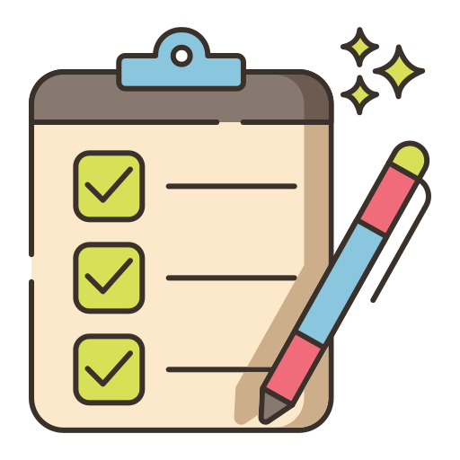

## I'll Do It Later

Every day, your typical college student sleeps on assignments or procrastinates on last-minute homework that is due at 11:59 PM. We always say that we will do it later just to repeat the same process all over again when the due date comes. It can be really hard to keep track of assignments, especially when you are balancing things like work, academics, and after-school activities. It is hard to keep up, and once you fall behind, it becomes hard to catch up. Trust me, I have been there, and it is not very fun if you spend your whole spring break just to catch up on late assignments.

## The New You

Luckily, there is a solution! I myself (Ahron Natividad) have created a solution to help reduce these stresses and procrastination. I present you **MaxGrind**, a smart study tracker that helps college stuents with their day-to-day daily assignments. It will have a user-friendly home screen where they will be prompted to create an account or login to help save their progress. Once they are logged in, users are taken to an empty dashboard where they can fill it up with "cards" where they can detail the name of the assignment, the description of what the assignment is, any attachments or links associated with the assignment, estimated difficulty, how high the priority is, and the deadline for the assignment. Students can organize it based on deadline, priority, or customize it in a way on things they need to get done on a specific day. It has all of your basic features in your typical assignment track, plus additional unique features.

## But Wait, There's More!

A unique feature about this assignment tracker would be how you could add your friends to form study groups or compete in a leaderboard where, depending on the difficulty and assignment of the task, you would earn points to rise the ranks of the leaderboard. This concept would be very similar to Duolingo, where, based on the difficulty and deadlines of these tasks, users would earn points to rise the ranks and announce the winners towards the end of each week. If they do specific tasks within the week, they might be able to earn double or even triple points during the day, quickly accelerating their points plus productivity during the day. This tracker utilizes the honor system, where it is meant to help you stay on track, as well as a friendly competition between friends. 

Another unique feature I plan to implement could be a way for users to see available office hours along with their respective date and times of when they open and close. For instance, users could add their professors or TA's office hours, where it will remind the user in an hour, 30 minute, and 5 minute intervals before the scheduled office hours to let users know when certain office hours are starting. Hopefully, reminding students of potential office hours could help students in interacting with their professors and TA where having that connection can provide really useful information not only in class but also through networking as well.

## Closing Remarks

Overall, this concept of an assignment tracker is a way to help students get out of the habit of putting things off until later by doing the things now. What I notice more and more is that people do expectionally better when compared to their peers. Everyone wants to be the best of the best, and the only way to show off your talents and skills is through competition with others. I believe that having a competing feature from an assignment tracker would help everyone reach their goals in the long run, where eventually, students might write goals unwillingly and soon find their path in what they want to do.