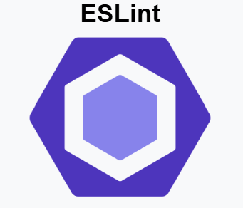

## ESLi 101: Introduction to ESLint on VS Code Part I

Using ESLint for the first time in VS Code was quite surprising for me. I did not know that even if the code runs perfectly, I was secretly violating several coding standards according to Lint. I was annoyed at first since every time I wanted to do a single-line comment in TypeScript, Lint would complain that I needed to add a space between the slash lines. Another was how Lint complains when you don’t have an empty line at the end of your code. These minor mistakes are what annoyed me since I really can’t tell if these red squiggly lines are grammatical errors or if these are acutally errors. I understand that these are normal coding standards where it widely used in the industry, but overall, trying to decipher what the gramatical problem is, as well as figuring out if a particular senction of code is works, is kind of difficult for me.

## ESLi 102: Introduction to ESLint on VS Code Part II

When I started using VS Code along with ESLint for my assignments, I started to get used to it, where I found really interesting feautres about it. First off, I just wanted to say that I am not a fan of naming variables, where I often take about 1-2 minutes to think about the names of these variables, and I sometimes use generic variables like i or j . ESLint helped me by doing autocompletions of names and variables based on my needs. Not only that, but it also autocompletes functions and what to put inside based on the function name and parameters. It was a really neat discovery where my code was clean and neat than ever before. I understand now how important ESLint is, in terms of grammar in coding, and using it to improve software quality and understanding. The more I started using it, the more I realized that it was just Grammarly for VS Code. I have been using Grammarly for a while now, where it helped me time and time again to make my writing professional, personal, persuasive, or even commedic so it is no surprise to me that ESLint is just the same, trying to make my code look more clean and more professional.

## ESLi 202: Intermediate ESLint on VS Code Part III

Overall, my initial thoughts of ESLint were annoying and difficult to understand, but once I saw its suggestive autocompletes, grammar suggestions, and variable name recommendations, it is not so bad where I am really looking forward to enhancing the quality of my code with ESLint.

This is just a side note, but I found it really fascinating that it can even detect hidden grammatical errors. I remember someone in one of my computer science classes that they were having trouble understanding this particular error in Java. It’s a hidden error that sometimes occurs when you copy and paste code. When looking it up, it is called a non-breaking space, where it is like a normal-looking space, but it is considered a character, and it is really hard to find even for the most experienced programmers. It is interesting that ESLint takes into account that where there might be some grammatical errors in my code that I have never even heard about!

