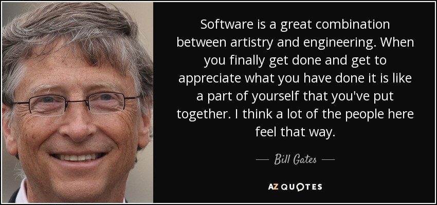

As the Spring 2026 semester comes to a close, I am grateful and satisfied with the amount of content covered during my time in ICS 314: Software Engineering. Getting to know my tablemates, learning PostgreSQL, building my professional persona, and even doing an actual project using GitHub were all part of what made software engineering really enjoyable for me. This course hits the mark on all things introductory towards software engineering, which includes:

- Design
- Implementation
- Testing
- Configuration Management
- Development Environments
- Quality Assurance
- Deployment
- Project Management

This course also helped me develop soft skills to effectively apply the above software engineering concepts. These include:

- Technical Writing
- Open Source Software Engineering
- Professional Development
- Software Engineering Technologies and Applications
  - Visual Studio Code
  - Git Configuration Management System
  - GitHub Project Hosting
  - Bootstrap 5 User Interface Network
  - NextJS Web Application Framework
  - React

Even though I was not fully able to understand all the concepts, I was glad to be able to understand the basics of these concepts, where I hope to improve upon these skills at a later time. There were certain concepts that I had trouble understanding, while there were others that I enjoyed and learned a lot. Here are some of my favorites.

## Quality Assurance

Quality assurance was one of my favorite concepts to learn since it acts as the [grammarly](https://ahron4.github.io/essays/grammerly-code.html) for coders. Quality assurance is a process of continuous monitoring of software development to help in preventing and fixing errors to ensure the code meets industry standards. For this concept, we were introduced to [ESLint](https://eslint.org/), which is an open-source project designed to fix errors in JavaScript code. We were also introduced to accepted testing using [Playwright](https://playwright.dev/), which is also an open source project designed for continuous testing of modern web applications. These two go hand-in-hand to help ensure everything is up to the industry standard, especially in our final project. Beyond web applications, I expect to see a lot of usage within quality assurance towards both my career and educational goals. For instance, I see myself building software for a security firm where other engineers could try to break the software to detect holes and identify edge cases within the code. Having knowledge of quality assurance helps keep my code clean and organized while having test cases to identify problems now before it reaches actual users with real sensitive data.

## Configuration Management

Configuration management (CM) was another favorite concept that I liked, which is a process where it manages the pieces of the project together. Things like environment settings, database schemas, and third-party dependencies to ensure your web application works with other users. One specific CM concept that was difficult for me was learning Postgres, and overall learning to build a database with PostgreSQL and Prisma. The documentation was hard to follow since I was very new to databases. It took some time, where I even used AI to help me with learning the concepts. After a few days or so, I was able to build databases based on our homework assignments, and even participated in helping building our own database for our final project. It was a great learning experience to see a bunch of error and not have a single clue of what's going on but, but having that skill in database management gave me one step closer to learning more about concepts relating to data science, and hopefully, I could use those skills relating to the Hawaii IT industry.

## Ethics in Software Engineering

During our last few week of the course, we had a small ethics debate in class where we simulated an actual courtroom, where we talked about the ethics in facial recognition. It is an interesting topic since both sides had very convincing pros and cons between the line in invasion of privacy to security and safely. Being able to talk about the ethical implication of software engineering really gave me some reflection and thoughts about it. Chances are, I will likely work in an industry or firm that will violate some sort of ethical implication that I believe in or that violate [ACM's Code of Ethics](https://www.acm.org/code-of-ethics). For instance, I might be helping in military installations where my code could harm people, or I might be working somewhere similar in terms of producing facial recognition software to help police better identify suspects, or on the other side, producing mass surveillance and invasion of privacy among the community. Considering ethics is an important part of being a software engineer, where I do hope to take this into account in times of when I am searching for an industry job.

## The End?

Overall, ICS 314 helped me lay the foundations in software engineering where I could apply these skills in the competitive job market of the IT industry. There were ups and downs in my learning, where I hope to continue my software engineering education by taking ICS 414: Software Engineering II. Being a part of a team for our final project was both a difficult and rewarding experience, where I one day hope to be part of a team again, working and meeting together to solve problems and make a product that will impact the community. Not only that, but I also want to contribute to the open-source community, where my contributions could also make an impact there.