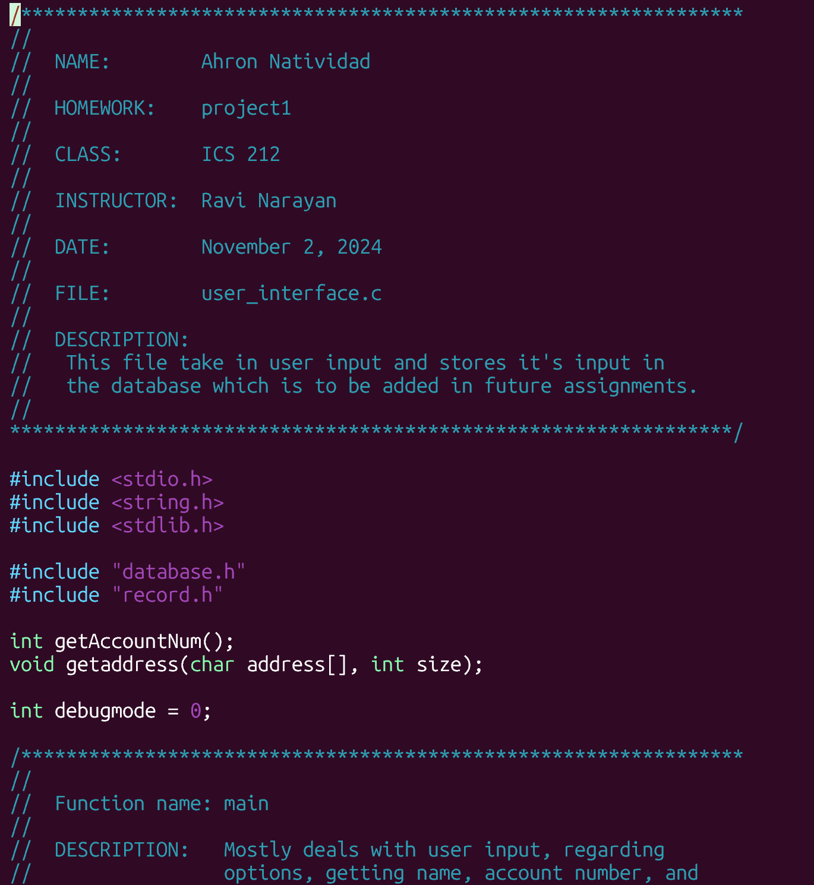

  
  

This was one of my projects that I was very proud of, but I had a very hard time understanding. For some context, this was a project and assignment for my ICS 212 Program Structure class, where we spent the majority of the semester learning the C programming language, its syntax, and the documentation in order for us to create a final product of a look-alike bank database and records through command lines in UHUNIX.

It was very hard to understand the instructions and overall learning C in general, since, unlike most programming languages, C is unstable in terms of memory management. You have to be careful when implementing things like arrays since you can more easily go out of bounds in your array but rather than an error, C would just continue, which would lead to a lot of different problems, especially if user-input is involved.

Not only that, but once we completed this project in C, we had another project to do in which we are doing to project again, but this time in C++.

Overall, it was a very difficult process to understand, but I learning a lot in terms of understanding how C and C++ syntax worked. Even though my project is kind of buggy at the moment, I hope that one day I can come back and fix my project and perhaps improve upon it.

