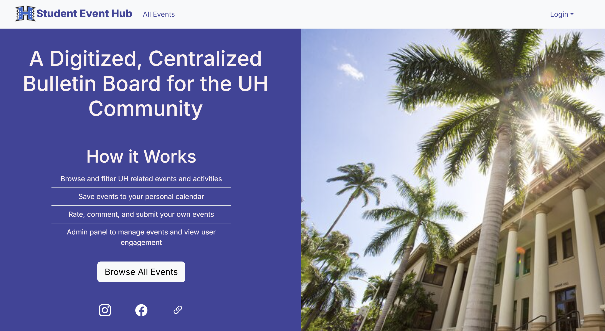
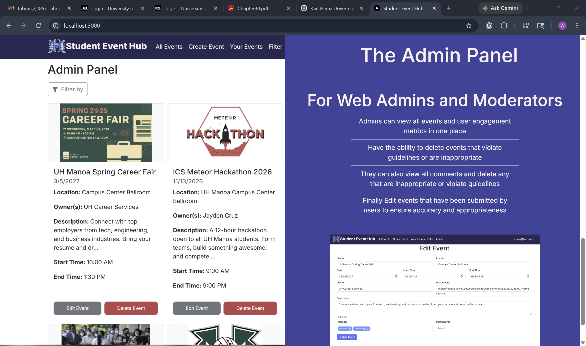
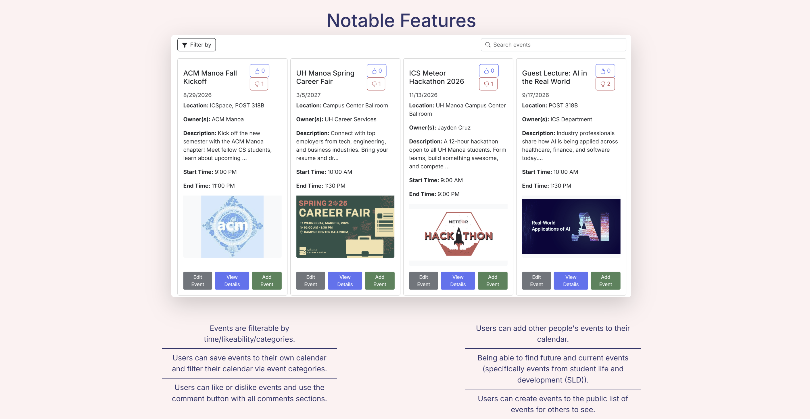
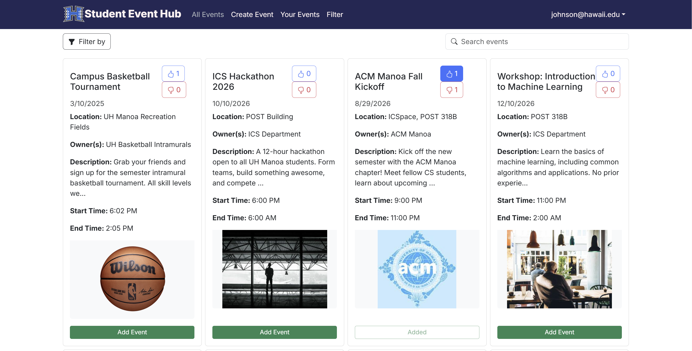

  
  
  
    

Student Event Hub is the name of our organization where me and three of my teammates created a web application to create a centralized bulletin board for the UH Community. This was part of our ICS 314, software engineering final project where we had about four week to implement a fully functioning application that is split into three milestones that we had to present in front of the class to show progress being made.

Me and my teammates use Github, Github issues, and Github projects to plan and visualize our work where we split our work into bit-size issues that were easy, management, and basically up for grabs when you had time to implement them. Every issue was timed so that we could reflect, and see errors early on during the development process. For instance, we had an approximate time on how long we could finish the issue. We also had a timer during our coding efforts, as well as our non-coding efforts like researching, or looking through documentation. After that, we finalize the issue with our actual time that it took to finish it. Once we were finished with an issue, the implementor would then ask other teammates to ensure everything is satisfied before the implementor merges the code into main and marks the issue as done. This was one of the processes that we had to do to ensure high quality code, and smooth progress towards milestones 1, 2, and 3.

The hardest part of the project was creating and implementing the database so that when we input sample data, the database changes, the web application also changes, and we should see these changes on the users side. An even harder difficulty was to ensure that those who created an event, should have the ability to edit and delete their own event cards while other users can only add these events in the your events page. It took almost the entire project length to get our database working, where once we got it working, we were able to fly through these issues with startling efficiency.

Overall, me and my teammates managed to get a finished product working towards the end of milestone 3. Even though there were bugs here and there, I plan to fix these bugs over summer break, or when I am free, to enhance our project through an upcoming milestone 4 that we plan to do once finals are over. I really liked working as a team and I hope I get to experience that kind of team bonding experience again somewhere in the future.
